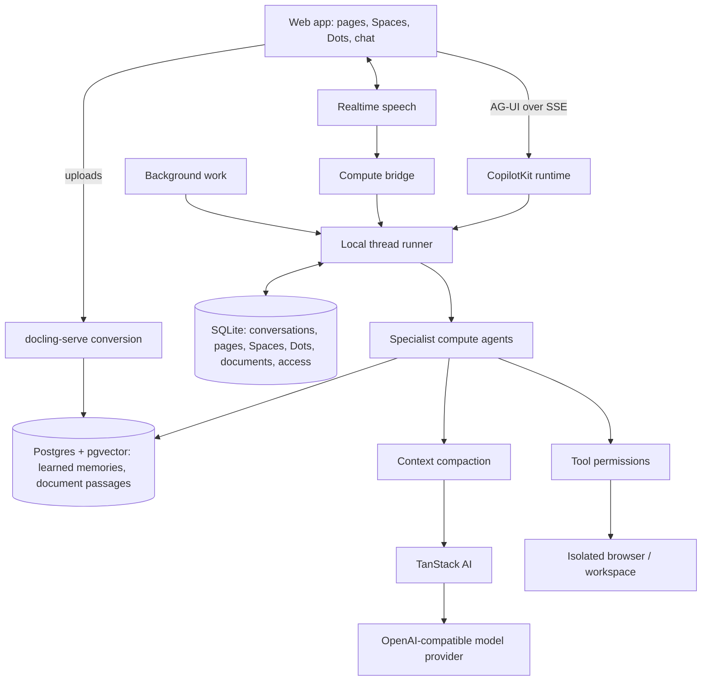

<div align="center">

# OpenDots

### Always-on AI coworkers that move between text and calls.

**An open-source template for persistent AI agents, each with its own computer. Available on Web and Mobile.**

Built with [CopilotKit](https://github.com/CopilotKit/CopilotKit) and [AG-UI](https://docs.ag-ui.com/introduction). · [Get started](#get-started) · [Overview](#overview) · [Architecture](#architecture) · [Features](#features) · [Contributing](CONTRIBUTING.md)

[](https://github.com/CopilotKit/OpenDots/actions/workflows/ci.yml)
[](./LICENSE)


<a href="https://trendshift.io/repositories/275323" target="_blank"></a>

Host OpenDots on your own infrastructure. Conversations are stored in the app's own SQLite database and answered by any OpenAI-compatible model; no CopilotKit account or cloud service is involved, and no usage telemetry is sent. Clone this template and customize it however you want.

[**Building on OpenDots? Meet with the CopilotKit team →**](https://www.copilotkit.ai/talk-to-an-engineer?ref=opendots_readme)

</div>

---

<div align="center">

<table><tr><td>

https://github.com/user-attachments/assets/4c74fe7d-ecdd-42dd-95da-5d34f9b9576e

</td></tr></table>

</div>

_Ask → browse → approve → save. A live computer view and a human review card appear right in chat, then the approved draft becomes an editable Space page. Enlarged for readability; idle time is trimmed and playback is accelerated._

## Overview

OpenDots is a starting point for building your own agent workspace. Clone it, define your Dots, connect your services, and adapt the interface and tools to your needs.

**A template, not a hosted product.** You run the application and configure its infrastructure. The template is in early development; the Features section below describes what's included and distinguishes local verification from connected-service testing.

### Spaces

A Space is a home for working documents. Dots appear separately in navigation and can be granted access to multiple Spaces in their settings. Each Dot has a default destination for saved pages; existing installations retain their original Space access. Browse pages in a searchable library, switch between grid and list views, and organize documents as nested subpages. Open a page in a focused visual editor with formatting, slash commands, and undo/redo. Write directly, save a conversation as a page, or ask a specialist to create and revise content.

Pages stay in the local workspace database, alongside their conversations, with a separate conversation for each page and specialist. Page links connect the document workspace to Dot chat. Manual editing works before you configure conversation services. Autosave reports its progress, failed saves retain your draft, and revision checks prevent stale edits from overwriting newer content. Markdown source mode remains available.

<div align="center">

<table><tr><td>

https://github.com/user-attachments/assets/d20c3405-4339-49e7-a799-43298728015c

</td></tr></table>

</div>

_Open a Space, navigate to its launch brief, ask Scout about the saved page, and continue in Dot chat. This recording uses live page chat and example launch content._

### Specialist Dots

Give each Dot a name, role, instructions, and permitted tools. A researcher can investigate a topic; a writer can turn findings into a draft. Inspect their work and control what they can do.

Each Dot learns durable facts from its own conversations and recalls the relevant ones before answering. You can review, edit and delete what each Dot has learned on the Memory screen, next to the **About me** preferences every Dot shares. Dots can ask each other questions with `ask_dot`; each Dot can opt out of being consulted.

### Documents

Upload files to a document library that Dots can search and cite. Share each document with every Dot, specific Dots, or the Dots working in a linked Space; Spaces show their linked documents beside their pages. Files attached in chat are saved to the library and shared with that Dot. Conversion runs locally with [docling-serve](https://github.com/docling-project/docling-serve), and search combines keyword and semantic matching over passages with page numbers.

### Dot computers

Each Dot can have its own computer, using [OpenBot](https://github.com/CopilotKit/OpenBot)'s container supervisor and computer service. Its browser profile and workspace files persist across stop/start. The Computer panel exposes browser control, human takeover, files, terminal output, and activity, with browser, file, and shell permissions set per Dot. The application keeps service credentials on the server and derives a different computer credential for each Dot.

See [Computer setup](docs/COMPUTERS.md) to build the pinned services and connect your deployment. Computer tools require those services; an unconfigured template does not execute commands on your host.

<div align="center">

<table><tr><td>

https://github.com/user-attachments/assets/30b691c3-0f66-4964-9fdb-67d4feab5568

</td></tr></table>

</div>

_Ask Scout to open a website, summarize it, save notes, and verify the file. Every computer action in this demo is requested through chat; CopilotKit tool renderers show the live browser, saved file, and terminal output inline._

### Review before saving

Ask a Dot to show a draft before saving it. A CopilotKit human-in-the-loop card pauses the conversation for **Approve & save** or **Decline**. Approval creates the page in an authorized Space and returns a link; retries with the same draft recover that saved page. A changed draft needs a new review. The agent continues after your decision.

### Text and calls

A continuous conversation keeps the Dot's avatar and status above the messages, with text and call controls close at hand. Work updates, source links, and call receipts appear in the timeline; a side panel shows results or the agent's computer.

Calls pair realtime speech with a separate compute agent, so the conversation can continue while longer work runs. Both use the same conversation context and tool permissions. The call screen includes a live timer, separate user and Dot captions, microphone mute, speaker mute, and a minimized view for continuing in chat. Voice needs separate provider configuration.

<div align="center">

<table><tr><td>

https://github.com/user-attachments/assets/3c06cf71-39ed-4e2b-b846-5463b2722389

</td></tr></table>

</div>

_Connect, talk, mute, minimize, and return to chat. This is a silent screen capture of a real call, with waiting time trimmed and playback accelerated._

### Slack

Not available in this fork yet. The upstream template reached Slack through CopilotKit Intelligence Channels, which this fork no longer uses. The workspace/user allowlist and message handling in `src/server/slack-channel.ts` are kept for a self-hosted Slack adapter; until it is wired, Slack settings are ignored and the setup panel reports Slack as unavailable.

## Architecture

### AG-UI connects the agent to the interface

[AG-UI](https://docs.ag-ui.com/introduction) carries streamed messages, tool calls, and agent state between the backend and CopilotKit components. Computer activity appears inline as the agent works; human-in-the-loop cards pause a tool call for your decision before it continues.

The template uses TanStack AI for model streaming and server-tool execution, and CopilotKit's open-source React SDK and runtime in their self-hosted SSE mode. A local thread runner (`src/server/thread-runner.ts`) stores every conversation's messages and run events in SQLite, replays them when a browser reconnects, and runs scheduled and voice turns in-process through the same path. The server's stored history is authoritative: clients can only append new user messages and answers to open tool calls.

Long conversations stay within a configurable context budget (`CONTEXT_MAX_TOKENS`). Old tool output is stubbed first; then older turns are replaced with a rolling summary that is cached per conversation and extended incrementally. Stored history is never rewritten.



You configure the model provider for your deployment; calls also need a speech provider. Credentials stay on the server. Missing configuration should produce a clear setup state, and test fixtures should remain visibly separate from live integrations.

[OpenMuse](https://github.com/CopilotKit/OpenMuse) and [OpenBot](https://github.com/CopilotKit/openbot) are code references for persistent work, agent computers, and execution controls. OpenDots can be adapted to your own workflows and deployment choices.

## Get started

Use **Node.js 24** and **npm**:

```sh
git clone https://github.com/CopilotKit/OpenDots.git
cd OpenDots
npm ci
cp .env.example .env
npm run dev
```

Open **http://127.0.0.1:5173**. You can create Spaces, write pages, and configure Dots before connecting services. To start chatting, add `OPENAI_API_KEY` and `OPENAI_MODEL` to `.env` and restart `npm run dev`. Learned memory and documents also need Postgres and docling-serve; `docker compose -f compose.dev.yml up -d` runs both locally (see [Setup](docs/SETUP.md#memory-and-documents)).

Do not run `copilotkit onboard` in this folder. OpenDots already contains its CopilotKit integration, and onboarding adds a second, generic one.

See [Setup](docs/SETUP.md) for configuration, calls, the browser service, and Docker.

## Data and privacy

Conversation messages, tool calls, run events, and cached conversation summaries are stored in the SQLite database at `DATABASE_PATH`, together with pages, workspace metadata, documents and their access rules. Uploaded files and their converted text live in `DOCUMENTS_DIR`. Learned memories and searchable document passages live in Postgres. Back up all three.

The configured model provider receives conversation context, including authorized page content, tool results, recalled memories, document passages, and the older turns it summarizes. Memory extraction sends each chat turn's user messages and reply to the memory model; document passages and search queries are sent to the embedding model. Documents are converted locally by docling-serve. Public-web research sends queries and selected URLs to Parallel by default; set `WEB_SEARCH_PROVIDER=disabled` to disable those tools. Speech integrations send data to their configured providers when used.

CopilotKit and mem0 telemetry are switched off in code at startup (`src/server/disable-telemetry.ts`), regardless of environment settings, and the upstream browser setup telemetry has been removed. Review the policies and retention settings of each service you configure.

## Features

| Area                       | Included                                                                                                      |
| -------------------------- | ------------------------------------------------------------------------------------------------------------- |
| Spaces and Specialist Dots | Saved names, role instructions, and per-Dot research and memory permissions                                   |
| Pages                      | Searchable library, visual editor, slash commands, autosave, and revision checks                              |
| Conversations              | React SDK chat, locally stored history with context compaction, page-specific conversations, and source links |
| Calls                      | WebRTC speech, delegated compute, bounded sessions, hangup, and timeline receipts                             |
| Background work            | Scheduled server-side turns in their original conversation, with pause and retry controls                     |
| Browser                    | Separate read-only public-page service with page capture and navigation limits                                |
| Dot computers              | Per-Dot browser profiles, files, shell, takeover, permissions, and action records through OpenBot             |
| Memory                     | Shared About me preferences, plus per-Dot learned memories you can review, edit and delete                    |
| Documents                  | Library with per-Dot and per-Space access, local conversion, hybrid search, versions and chat attachments     |
| Dot consultations          | Dots ask each other questions in separate, restricted consultation threads                                    |
| Deployment                 | Local Node setup and separate application, browser, Postgres and docling-serve containers                     |

Scheduled tasks run in their original conversation. If a worker stops or its lease expires during a run, OpenDots marks that run **Interrupted** and waits for an explicit retry. Review its pages and computer actions, then use **Retry after review** when appropriate. Completed effects may already be present even when a run has no final result.

Local checks cover setup, persistence, permissions, SDK failure handling, and browser isolation. Automated tests use service fixtures, including runs through the real CopilotKit request handler against the local thread runner. The upstream live verification and [recording notes](docs/demos/README.md) predate this fork's switch from CopilotKit Intelligence to local storage; live model verification of the local storage path is still to be repeated.

This is a single-owner starting point. Shared editing, invitations, and interactive page embeds are not included. Schedules are recurring instructions, not a complete goal or event-trigger system. Specialist Dots have separate roles and conversations and can consult each other one level deep; multi-Dot group conversations are further work.

### Extending the template

- Add identity, Space membership, and shared page editing for multi-user deployments.
- Add richer page content and document previews.
- Add event triggers and a persistent responsibility lifecycle.
- Extend tools and approval flows for your own workflows.
- Add richer artifacts, connected-app context, and specialist coordination.

## Contributing

See [Contributing](CONTRIBUTING.md) for development guidance and [Security](SECURITY.md) for reporting issues. Contributions should describe the workflow they enable, include verification evidence, and distinguish live integrations from fixtures.

## References

- [AG-UI documentation](https://docs.ag-ui.com/introduction)
- [CopilotKit documentation](https://docs.copilotkit.ai)
- [OpenMuse](https://github.com/CopilotKit/OpenMuse)
- [OpenBot](https://github.com/CopilotKit/openbot)
- [OpenTag](https://github.com/CopilotKit/OpenTag) — Channels SDK integration reference

## License

[MIT](LICENSE).

## Public-web research

Parallel is selected by default in live research and Dot conversations. Ask a topic-only question to discover and read up to five sources, or supply URLs to extract them directly. Sources are saved with their links. A browser worker is not required for this research path; computer tools remain available for interactive work.

`WEB_SEARCH_PROVIDER=browser` preserves the existing URL-only browser reader, and `WEB_SEARCH_PROVIDER=disabled` disables these research tools. Workspace and Dot research permissions, pause and cancellation controls still apply. Sample research remains fictional and does not contact a provider.

Queries, requested URLs, a stable session identifier and the research objective are sent to `https://search.parallel.ai/mcp`. Memories and complete conversations are not automatically forwarded to Parallel. Model-selected objectives may still contain context from the conversation. The anonymous service is free for light use with provider-managed limits; set `PARALLEL_API_KEY` on the server for production or higher limits. Provider errors and empty results are reported rather than replaced with invented evidence. See [Parallel Search MCP documentation](https://docs.parallel.ai/integrations/mcp/search-mcp).
